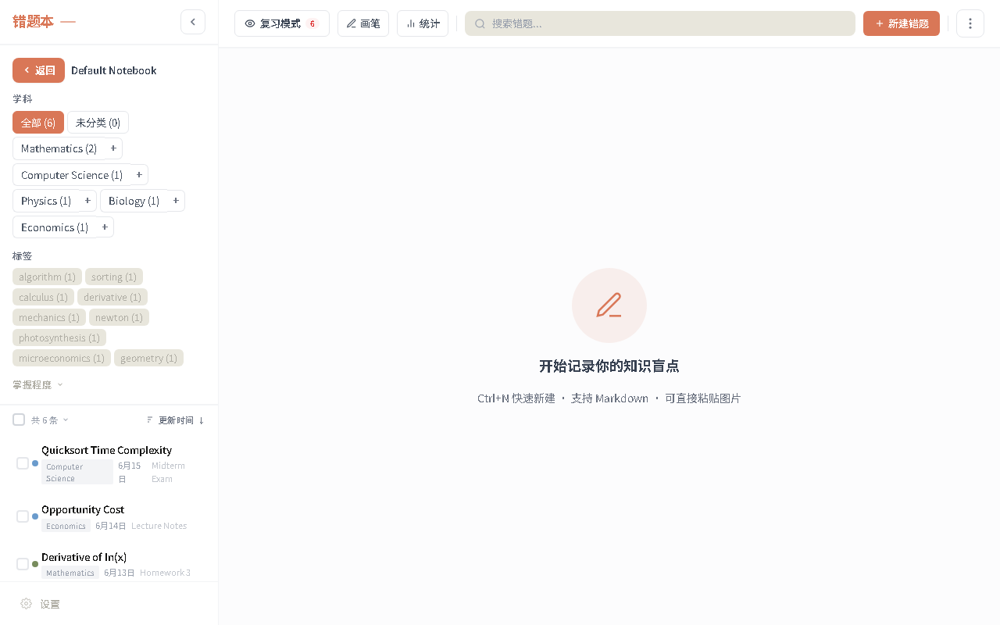
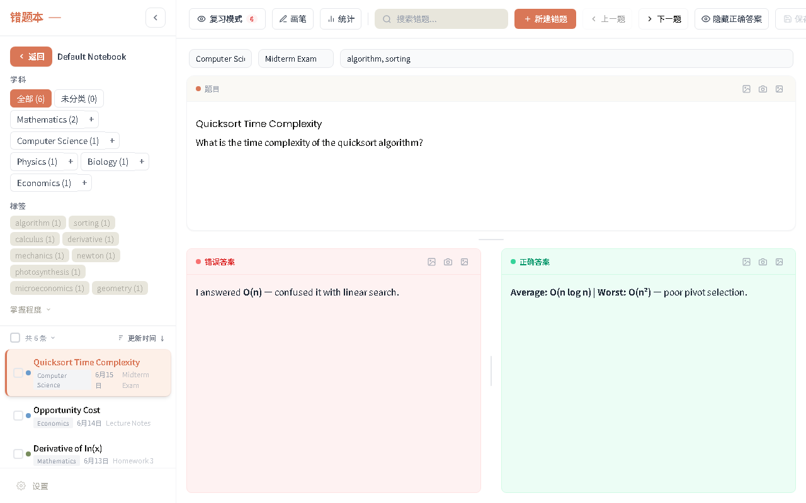

# Note App Clean

一个围绕错题整理、复习追踪和学习资料管理打造的全栈项目。它从本地优先的笔记应用出发，逐步扩展到了登录认证、远程同步、数据库迁移和后续 AI Agent 接入能力。


<p align="center">
  
  
</p>

## Project Highlights

- 本地优先 + 远程同步：前端可先写入本地，再通过 API 同步到 MySQL
- 前后端一体化：包含 Vue 3 前端、FastAPI 后端、SQLAlchemy ORM、Alembic 迁移
- 认证系统已落地：支持注册、登录、JWT 鉴权、当前用户信息接口
- 业务结构清晰：notebooks、entries、review_logs、users 等模块已拆分
- 可继续扩展 AI：已经为后续接入 DeepAgents / LangChain 留出了后端演进空间

## Overview

这个项目适合用来展示以下几类能力：

- 前端界面开发与状态管理
- 后端接口设计与数据库建模
- 登录认证与会话管理
- 本地存储和远程持久化的双数据流设计
- 从单体学习项目逐步演进到 AI 应用的工程思路

它既可以作为学习型作品集项目，也可以继续往“学习助手 / 错题 AI 助手”方向扩展。

## Core Features

- 错题本 / 笔记本管理
- 条目创建、编辑、删除、搜索
- 标签、学科、素材类型筛选
- 复习记录与统计
- 登录、注册、当前用户鉴权
- 本地离线数据存储
- 远程 MySQL 数据持久化
- Alembic 迁移管理
- Electron 桌面端打包

## Login System

当前登录系统基于 FastAPI + JWT 实现，核心能力包括：

- 用户注册：`/api/users/signup`
- 用户登录：`/api/login/access-token`
- 获取当前用户：`/api/users/me`
- 密码安全存储：使用哈希而不是明文密码
- 前端鉴权接入：请求通过 `Authorization: Bearer <token>` 调用后端接口

目前这套认证系统已经能完成：

- 新用户注册
- 登录后保存 token
- 页面刷新后维持登录态
- 受保护接口按登录状态访问

## Tech Stack

### Frontend

- Vue 3
- TypeScript
- Vite
- Tailwind CSS
- Electron

### Backend

- FastAPI
- SQLAlchemy ORM
- MySQL
- Alembic
- PyJWT
- pwdlib / Argon2 password hashing

### Storage

- IndexedDB
- MySQL

## Project Structure

```text
notes-app-clean/
├─ alembic/                 # Alembic migration files
├─ electron/                # Electron main/preload
├─ src/
│  ├─ components/           # Vue UI components
│  ├─ composables/          # Frontend business logic
│  ├─ db_sql/               # FastAPI backend, models, routers, auth
│  ├─ services/             # API / local data access layer
│  ├─ types/                # TypeScript types
│  └─ utils/                # Utility functions
├─ tests/                   # E2E and related tests
├─ package.json
├─ requirements.txt
└─ alembic.ini
```

## Technical Challenges

这个项目里比较有代表性的技术点，不只是“把功能写出来”，更在于把不同层连接起来：

- 本地存储和远程数据库并存
  - 浏览器侧有 IndexedDB，本地可先使用
  - 后端侧有 MySQL，负责远程持久化
  - 这要求前端服务层处理同步、回写和鉴权

- 登录系统接入现有项目
  - 原项目最开始不是围绕用户体系设计的
  - 接入 JWT 认证时，需要同时改路由、前端请求层、登录页、设置页和本地状态

- 数据库结构演进
  - 从直接 `create_all` 的学习式写法，过渡到 Alembic 管理迁移
  - 这意味着后续改表要走 revision / upgrade，而不是运行时自动改表

- 多用户隔离仍是下一阶段重点
  - 当前已经有用户认证
  - 但如果要做真正多用户安全隔离，还需要把业务数据继续补齐 `owner_id / user_id` 归属设计

## AI Agent Roadmap

这个项目后续最适合扩展的不是“自动录入错题”，而是“学习辅助 Agent”。当前比较合理的方向是：

- 读取错题并做薄弱点总结
- 根据标签、学科、复习记录给出学习建议
- 帮用户分析某一题为什么错
- 搜索相似错题
- 生成每日复习计划

建议的接入顺序：

1. 先做只读 Agent
2. 先让 Agent 查数据、分析数据、返回建议
3. 再考虑带确认的写操作
4. 最后再考虑更复杂的多轮记忆和工具链

如果继续往下做，比较适合接入：

- DeepAgents
- LangChain / LangGraph
- DeepSeek 或 OpenAI 模型接口
- LangSmith tracing

## Local Development

### Frontend

```bash
npm install
npm run dev
```

### Backend

```bash
python -m venv .venv
.venv\Scripts\activate
pip install -r requirements.txt
uvicorn src.db_sql.main:app --reload
```

## Environment Variables

项目使用 `.env` 管理后端配置，常见变量包括：

```env
MYSQL_HOST=localhost
MYSQL_PORT=3306
MYSQL_USER=root
MYSQL_PASSWORD=your_password
MYSQL_DATABASE=notes_app_db
JWT_SECRET_KEY=your_jwt_secret
ACCESS_TOKEN_EXPIRE_MINUTES=10080
```

如果后续接入大模型或 Agent，建议继续在同一个 `.env` 中配置模型密钥，例如：

```env
DEEPSEEK_API_KEY=your_key
LANGSMITH_API_KEY=your_key
LANGSMITH_TRACING=true
LANGSMITH_PROJECT=notes-app-agent
```

## Database Migration

常用 Alembic 命令：

```bash
alembic revision --autogenerate -m "your message"
alembic upgrade head
```

## Notes

- 当前项目同时存在本地存储和远程后端两套数据路径
- 如果要做严格多用户隔离，建议继续补 `owner_id / user_id` 级别的数据归属设计
- 当前已经具备继续扩展成学习型 AI Agent 项目的基础

## License

MIT
